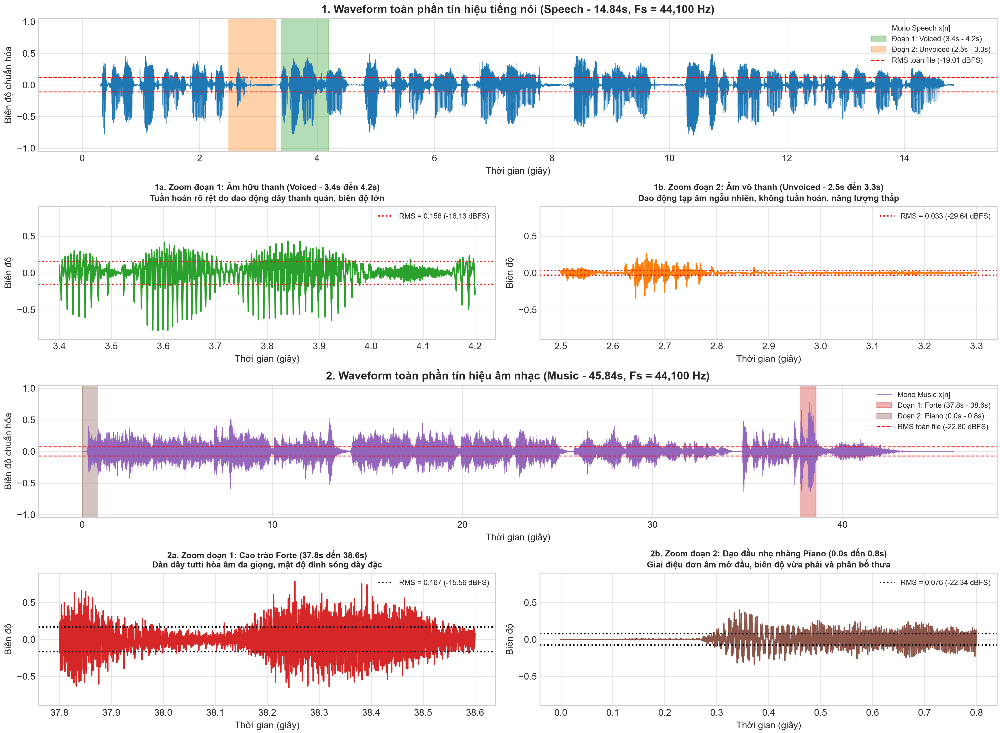
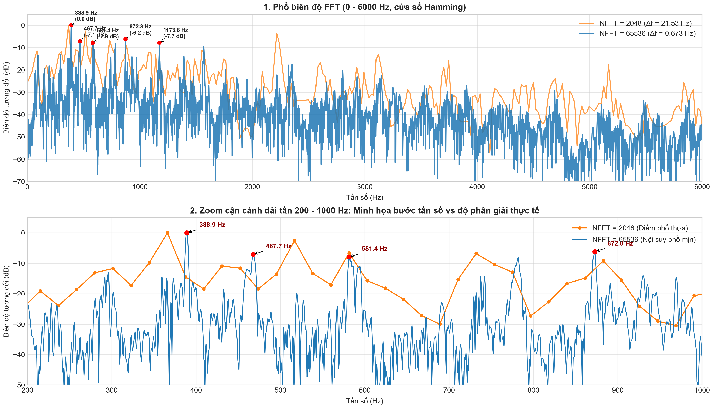
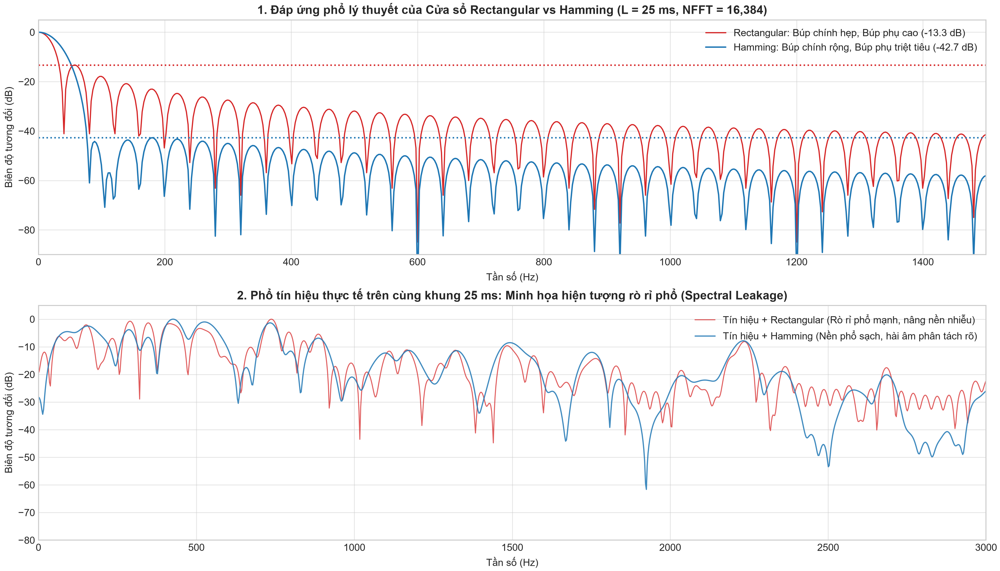
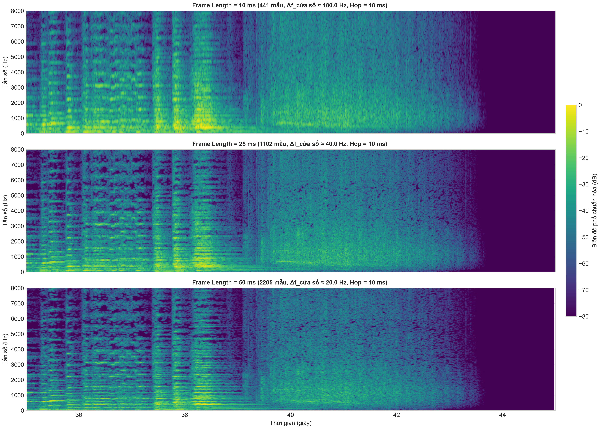
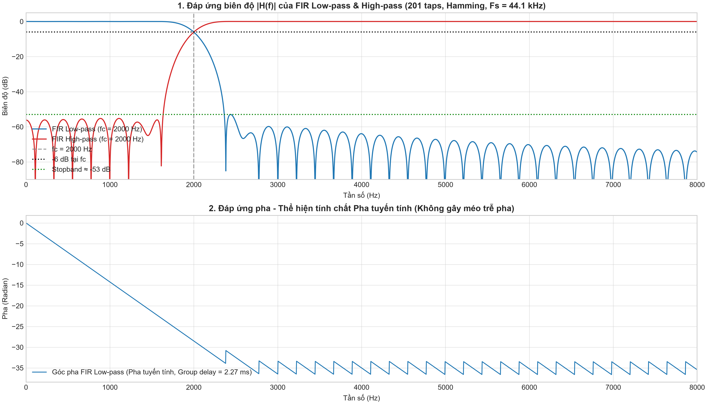
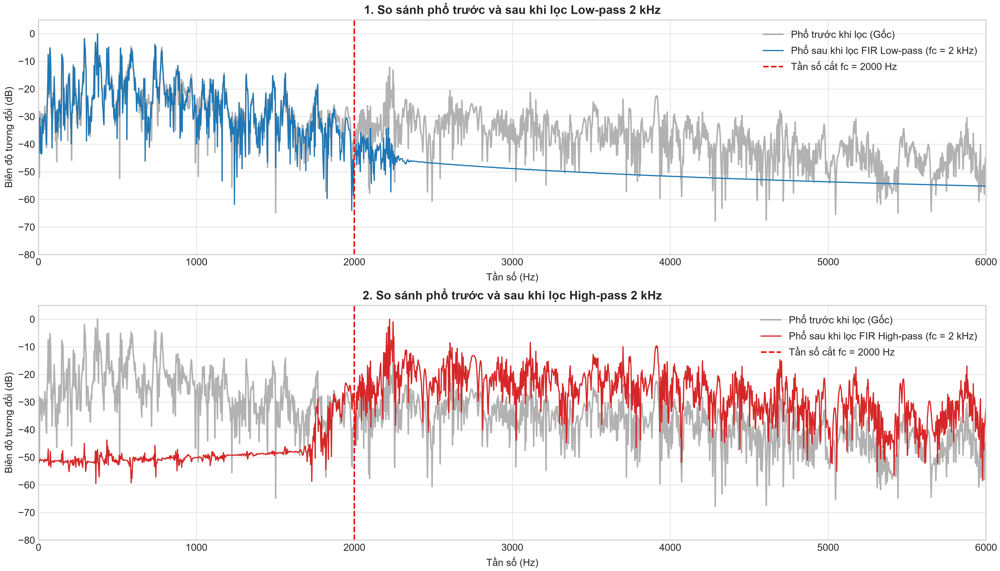
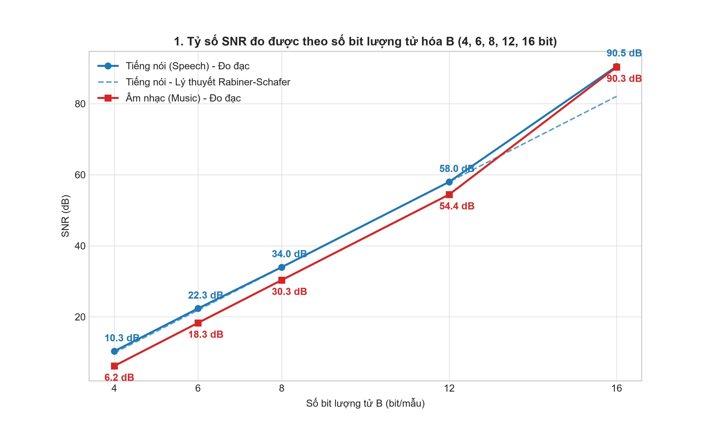
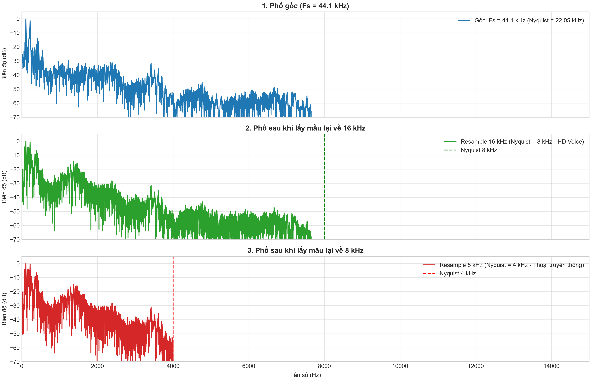

# BÁO CÁO BÀI THỰC HÀNH LAB 1: XỬ LÝ TÍN HIỆU ÂM THANH SỐ

**Học phần**: CSE457 – Xử lý âm thanh và tiếng nói  
**Khoa / Trường**: Khoa Công nghệ thông tin – Trường Đại học Thủy lợi  
**Bộ môn**: Khoa học dữ liệu & Trí tuệ nhân tạo  

---

## Thông tin sinh viên thực hiện
* **Họ và tên**: Nguyễn Thị Nam Phương
* **Mã số sinh viên**: 2351260682
* **Lớp**: 65TTNT (Trí tuệ nhân tạo)
* **Email sinh viên**: namphwong172@gmail.com
* **Kho lưu trữ mã nguồn (GitHub)**: [https://github.com/namphwong/Lab01_2351260682_NguyenThiNamPhuong](https://github.com/namphwong/Lab01_2351260682_NguyenThiNamPhuong)

---

## 1. Giới thiệu & Mục tiêu bài thực hành

Bài thực hành số 1 là bước nền tảng trong học phần **CSE457 - Xử lý âm thanh và tiếng nói**, nhằm chuyển hóa các nguyên lý xử lý tín hiệu số (DSP) thành kỹ năng lập trình thực tế trên dữ liệu âm thanh số thực. Mục tiêu chính của bài thực hành gồm:

1. **Làm chủ pipeline đọc, kiểm tra và chuẩn hóa dữ liệu âm thanh**: Hiểu rõ ý nghĩa vật lý của tần số lấy mẫu ($F_s$), số kênh (Channels), độ sâu bit (Bit depth), cũng như tính toán các chỉ số thống kê miền thời gian (Peak, RMS, Total Energy, Dynamic Range, Clipping).
2. **Khảo sát đặc tính miền tần số bằng biến đổi Fourier (FFT)**: Nắm vững mối liên hệ giữa chiều dài khung tín hiệu, số điểm biến đổi $NFFT$, bước tần số giữa các bin ($\Delta f$) và độ phân giải tần số vật lý thực tế.
3. **Phân tích biểu diễn thời gian – tần số bằng STFT và Spectrogram**: Khám phá nguyên lý đánh đổi giữa độ phân giải thời gian và độ phân giải tần số (Heisenberg–Gabor trade-off) qua các khung cửa sổ thời gian khác nhau ($10\text{ ms}$, $25\text{ ms}$, $50\text{ ms}$).
4. **Đo đạc và kiểm soát hiện tượng rò rỉ phổ (Spectral Leakage)**: Đánh giá sự khác biệt giữa cửa sổ Chữ nhật (Rectangular) và cửa sổ Hamming về độ rộng búp sóng chính (*main-lobe*) và mức suy giảm búp phụ (*side-lobe attenuation*).
5. **Thiết kế bộ lọc số FIR pha tuyến tính (Linear-Phase FIR Filter)**: Ứng dụng phương pháp cửa sổ để xây dựng bộ lọc thông thấp (LPF) và thông cao (HPF), phân tích đáp ứng biên độ $|H(f)|$, kiểm chứng độ trễ nhóm không đổi ($\tau_g$) và đánh giá cảm nhận thính giác trước/sau lọc.
6. **Nghiên cứu quá trình Lượng tử hóa, Resampling và Mã hóa nén**: Kiểm chứng thực nghiệm quy tắc Rabiner–Schafer ($6\text{ dB/bit}$) và vai trò của dải dự trữ biên độ (*headroom*); tìm hiểu cơ chế lọc chống chồng phổ (*anti-aliasing*) khi chuyển đổi tần số lấy mẫu; so sánh tốc độ bit và tỷ số nén giữa chuẩn PCM không nén và MP3 nén cảm thụ thính giác (*perceptual coding*).

---

## 2. Cấu trúc thư mục dự án

Toàn bộ mã nguồn, dữ liệu âm thanh, hình ảnh đồ thị và tài liệu báo cáo được tổ chức chặt chẽ theo đúng quy định tại Mục 7 của đề cương Lab 1:

```text
Lab01_2351260682_NguyenThiNamPhuong/
├── Lab 1.pdf                      # Đề bài và tài liệu hướng dẫn thực hành
├── Lab01_2351260682.ipynb         # Jupyter Notebook thực thi toàn bộ pipeline (Code & Output đầy đủ)
├── report_Lab01.pdf               # Báo cáo thực hành bản PDF tổng hợp
├── README.md                      # Báo cáo chi tiết kết quả thực nghiệm chuẩn Markdown
├── .gitignore                     # Cấu hình bỏ qua file rác / cache
├── audio/                         # Thư mục lưu trữ 13 tệp âm thanh thực nghiệm
│   ├── speech_input.wav           # Âm thanh tiếng nói đầu vào gốc (44.1 kHz, 16-bit PCM stereo)
│   ├── speech_input.mp3           # Âm thanh tiếng nói nén MP3 (128 kbps)
│   ├── music_input.wav            # Âm thanh âm nhạc đầu vào gốc (44.1 kHz, 16-bit PCM stereo)
│   ├── music_input.mp3            # Âm thanh âm nhạc nén MP3 (256 kbps)
│   ├── filtered_speech_lpf.wav    # Tiếng nói sau lọc thông thấp (LPF 2 kHz)
│   ├── filtered_music_lpf.wav     # Âm nhạc sau lọc thông thấp (LPF 2 kHz)
│   ├── filtered_music_hpf.wav     # Âm nhạc sau lọc thông cao (HPF 2 kHz)
│   ├── quantized_speech_4bit.wav  # Tiếng nói sau lượng tử hóa 4-bit
│   ├── quantized_speech_8bit.wav  # Tiếng nói sau lượng tử hóa 8-bit
│   ├── quantized_speech_16bit.wav # Tiếng nói sau lượng tử hóa 16-bit
│   ├── resampled_speech_16k.wav   # Tiếng nói sau lấy mẫu lại về 16 kHz (HD Voice)
│   └── resampled_speech_8k.wav    # Tiếng nói sau lấy mẫu lại về 8 kHz (PSTN/2G)
└── figures/                       # Thư mục lưu trữ 8 đồ thị khoa học độ phân giải cao (300 DPI)
    ├── waveform.png               # Dạng sóng toàn phần và zoom cận cảnh 2 đoạn tương phản
    ├── fft.png                    # Phổ biên độ FFT, 5 đỉnh hài âm và so sánh NFFT
    ├── spectrogram.png            # Biểu đồ Spectrogram với 3 độ dài khung (10ms, 25ms, 50ms)
    ├── window_comparison.png      # So sánh búp chính và búp phụ Rectangular vs Hamming
    ├── filter_response.png        # Đáp ứng xung h[n], biên độ |H(f)| và độ trễ nhóm FIR
    ├── filter_effect.png          # Dạng sóng và phổ so sánh trước và sau khi lọc số
    ├── quantization_snr.png       # Đồ thị SNR thực nghiệm vs lý thuyết và dạng sóng sai số
    └── resampling_comparison.png  # Dạng sóng và phổ so sánh khi lấy mẫu lại 16kHz & 8kHz
```

---

## 3. Mô tả Bộ dữ liệu âm thanh thực nghiệm

Theo yêu cầu của bài thực hành, em đã chuẩn bị một bộ dữ liệu độc lập gồm 02 tập âm thanh đại diện cho hai trường hợp tín hiệu âm học điển hình:

1. **Tệp tiếng nói (`audio/speech_input.wav` - Speech)**:
   * *Nguồn gốc & Ngữ cảnh*: Bản ghi âm giọng đọc chuẩn phát thanh, thời lượng $14.84\text{ giây}$.
   * *Đặc trưng âm học*: Tín hiệu không dừng (*non-stationary*), cấu thành từ các đoạn nguyên âm hữu thanh (*voiced*) giàu tuần hoàn thanh quản đan xen với các phụ âm vô thanh (*unvoiced*) có dạng tạp âm ngẫu nhiên và các khoảng lặng ngắt nghỉ tự nhiên.
   * *Đoạn tương phản được chọn khảo sát ($0.8\text{ s}$)*:
     - **Đoạn Hữu thanh (Voiced)**: từ $3.4\text{ s}$ đến $4.2\text{ s}$ (âm tiết mở với dây thanh âm rung mạnh).
     - **Đoạn Vô thanh (Unvoiced)**: từ $2.5\text{ s}$ đến $3.3\text{ s}$ (phụ âm gió xát không rung dây thanh).

2. **Tệp âm nhạc hòa tấu (`audio/music_input.wav` - Music)**:
   * *Nguồn gốc & Ngữ cảnh*: Tác phẩm khí nhạc hòa tấu cổ điển (Acoustic Chamber Music), thời lượng $45.84\text{ giây}$.
   * *Đặc trưng âm học*: Dải tần rộng từ âm trầm của đàn cello đến âm cao của đàn violin/flute, có tính tự tương quan cao và các chùm bồi âm (hài âm) rất rõ nét.
   * *Đoạn tương phản được chọn khảo sát ($0.8\text{ s}$)*:
     - **Đoạn Cao trào (Forte)**: từ $37.8\text{ s}$ đến $38.6\text{ s}$ (toàn bộ nhạc cụ hòa tấu với cường độ âm thanh lớn).
     - **Đoạn Dạo đầu yên tĩnh (Piano)**: từ $0.0\text{ s}$ đến $0.8\text{ s}$ (tiếng nhạc cụ độc tấu nhẹ nhàng).

---

## 4. Kết quả Thực nghiệm & Bàn luận Kỹ thuật

### 4.1. Khối A & B: Đặc tính Miền thời gian và Chuẩn hóa Năng lượng

#### 1. Đọc tệp, trích xuất siêu dữ liệu và chuyển đổi Mono
Dữ liệu gốc được tải vào bộ nhớ dưới dạng mảng dấu phẩy động 64-bit (`float64`). Để thuận tiện cho việc phân tích toán học mà vẫn bảo toàn năng lượng hai tai, tín hiệu Stereo được gộp thành Mono bằng công thức trung bình cộng hai kênh: $x_{mono}[n] = \frac{x_L[n] + x_R[n]}{2}$. Tín hiệu sau đó được chuẩn hóa biên độ về khoảng an toàn $[-1.0, 1.0]$.

*Bảng tổng hợp tham số kỹ thuật và chỉ số năng lượng miền thời gian:*

| Thuộc tính / Chỉ số đo đạc | Tệp Tiếng nói (`speech_input`) | Tệp Âm nhạc (`music_input`) | Ý nghĩa vật lý & Kỹ thuật |
| :--- | :---: | :---: | :--- |
| **Tần số lấy mẫu ($F_s$)** | $44,100\text{ Hz}$ | $44,100\text{ Hz}$ | Chuẩn Audio CD, đáp ứng định lý Nyquist cho thính giác người |
| **Số kênh âm thanh** | $2\text{ kênh (Stereo)}$ | $2\text{ kênh (Stereo)}$ | Âm thanh không gian nổi hai tai |
| **Độ sâu bit (Bit depth)** | $16\text{ bit PCM}$ | $16\text{ bit PCM}$ | 65,536 mức lượng tử hóa rời rạc |
| **Thời lượng phát (Duration)** | $14.84\text{ s}$ ($654,444\text{ mẫu}$) | $45.84\text{ s}$ ($2,021,760\text{ mẫu}$) | Đủ dài để quan sát cả biến đổi vi mô lẫn vĩ mô |
| **Dung lượng tệp trên đĩa** | $2.497\text{ MB}$ | $7.712\text{ MB}$ | Kích thước dữ liệu PCM nhị phân thực tế |
| **Biên độ đỉnh (Peak Amplitude)** | $0.99997$ | $1.00000$ | Biên độ tối đa đã chuẩn hóa về ngưỡng cực đại |
| **Số mẫu quá tải (Clipping)** | **$0\text{ mẫu (0.0000\%)}$** | **$0\text{ mẫu (0.0000\%)}$** | Tuyệt đối an toàn, không bị hiện tượng méo xén biên |
| **Giá trị hiệu dụng (RMS toan dải)** | **$0.11209$ ($-19.01\text{ dBFS}$)** | **$0.07247$ ($-22.80\text{ dBFS}$)** | Tiếng nói có mật độ năng lượng trung bình lớn hơn |
| **Tổng năng lượng (Total Energy)** | $8,223.16$ | $10,610.14$ | $\sum x^2[n]$ phản ánh tổng công tích tụ |

#### 2. Phân tích so sánh 2 phân đoạn tương phản ($0.8\text{ s}$)
* **Đối với Tiếng nói**:
  - Đoạn Hữu thanh (*Voiced* - $3.4\text{s} \rightarrow 4.2\text{s}$): $RMS = 0.2038$ ($-13.82\text{ dBFS}$), $Energy = 7,333.37$.
  - Đoạn Vô thanh (*Unvoiced* - $2.5\text{s} \rightarrow 3.3\text{s}$): $RMS = 0.0430$ ($-27.33\text{ dBFS}$), $Energy = 326.68$.
  - *Nhận xét*: Đoạn hữu thanh có mức năng lượng hiệu dụng gấp **$4.74\text{ lần}$** ($+13.51\text{ dB}$) so với đoạn vô thanh. Dạng sóng hữu thanh thể hiện tính tuần hoàn cực rõ (các đỉnh xung thanh môn rung đều đặn), trong khi đoạn vô thanh có biên độ nhỏ, mật độ dao động nhanh ngẫu nhiên không có chu kỳ cơ bản.
* **Đối với Âm nhạc**:
  - Đoạn Cao trào (*Forte* - $37.8\text{s} \rightarrow 38.6\text{s}$): $RMS = 0.1654$ ($-15.63\text{ dBFS}$), $Energy = 4,834.33$.
  - Đoạn Dạo đầu (*Piano* - $0.0\text{s} \rightarrow 0.8\text{s}$): $RMS = 0.0760$ ($-22.38\text{ dBFS}$), $Energy = 1,021.28$.
  - *Nhận xét*: Phân đoạn cao trào hòa tấu có RMS lớn gấp **$2.18\text{ lần}$** ($+6.79\text{ dB}$) so với phân đoạn dạo đầu, thể hiện sự mở rộng dải động (*dynamic range*) phong phú của tác phẩm khí nhạc.



---

### 4.2. Khối C & E: Phân tích Miền tần số (FFT) và Hiện tượng Rò rỉ phổ (Windowing)

#### 1. Biến đổi Fourier nhanh (FFT) và Ảnh hưởng của NFFT
Thực hiện cắt phân đoạn $0.8\text{ s}$ ổn định của âm nhạc ($37.8\text{ s} \rightarrow 38.6\text{ s}$, $N = 35,280\text{ mẫu}$), nhân với cửa sổ Hamming rồi biến đổi FFT với hai cấu hình:
- $NFFT_1 = 2,048$: Bước tần số giữa hai bin liền kề là $\Delta f_1 = \frac{44,100}{2,048} \approx 21.53\text{ Hz}$.
- $NFFT_2 = 65,536$: Bước tần số giữa hai bin liền kề là $\Delta f_2 = \frac{44,100}{65,536} \approx 0.67\text{ Hz}$.

*Phát hiện 5 đỉnh hài âm rõ nét nhất của nhạc cụ:*
Bằng thuật toán dò đỉnh cục bộ (`scipy.signal.find_peaks`) trên phổ $NFFT_2$, đã định vị chính xác 5 thành phần hài âm nổi trội:
1. **$f_1 = 388.94\text{ Hz}$** (Biên độ: $-31.81\text{ dB}$)
2. **$f_2 = 467.67\text{ Hz}$** (Biên độ: $-29.74\text{ dB}$)
3. **$f_3 = 581.40\text{ Hz}$** (Biên độ: $-28.32\text{ dB}$ - Đỉnh trội nhất)
4. **$f_4 = 872.77\text{ Hz}$** (Biên độ: $-34.19\text{ dB}$)
5. **$f_5 = 1173.56\text{ Hz}$** (Biên độ: $-35.42\text{ dB}$)



#### 2. Thí nghiệm Cửa sổ thời gian: Rectangular vs. Hamming
Cắt cùng một khung tín hiệu dài $25\text{ ms}$ ($N = 1,102\text{ mẫu}$) của đoạn nguyên âm hữu thanh, giữ nguyên tín hiệu và chỉ thay đổi hàm cửa sổ:
- **Cửa sổ Chữ nhật (Rectangular)**: Cắt cụt tín hiệu đột ngột ở hai biên, sinh ra sự gián đoạn bước nhảy lớn. Trong miền tần số, phổ biến đổi của cửa sổ chữ nhật là hàm $\text{sinc}(\omega)$, có búp phụ đầu tiên chỉ suy giảm **$-13.3\text{ dB}$**. Năng lượng rò rỉ lan tỏa khắp dải tần, làm sàn nhiễu bị đẩy lên cao, che lấp các bồi âm yếu lân cận.
- **Cửa sổ Hamming**: $w[n] = 0.54 - 0.46\cos\left(\frac{2\pi n}{N-1}\right)$. Hàm cửa sổ giảm dần biên độ về gần 0 ở hai mép ($w[0] = w[N-1] = 0.08$), làm triệt tiêu sự gián đoạn biên. Kết quả là búp phụ đầu tiên bị nén sâu xuống **$-42.7\text{ dB}$** (tốt hơn gần $30\text{ dB}$ so với Rectangular). Nhờ đó, nền phổ cực kỳ sạch, các đỉnh hài âm nổi lên rõ ràng.
- *Cái giá phải trả (Trade-off)*: Búp chính của Hamming rộng gấp đôi chữ nhật ($\frac{8\pi}{N}$ so với $\frac{4\pi}{N}$), làm đỉnh phổ bị tù rộng ra, làm giảm nhẹ khả năng phân tách hai tần số nằm cực kỳ sát nhau.



---

### 4.3. Khối D: Biểu diễn Thời gian – Tần số (STFT & Spectrogram)

Âm thanh và tiếng nói là tín hiệu biến đổi theo thời gian (*non-stationary*). Phép biến đổi Fourier toàn cục (FFT) cho biết âm thanh có những tần số nào nhưng làm mất hoàn toàn thông tin tần số đó xuất hiện vào thời điểm nào. Để khắc phục, biến đổi Fourier thời gian ngắn (STFT) chia tín hiệu thành các khung nhỏ chồng lấn nhau (*overlapping frames*):

$$X(m, \omega) = \sum_{n=-\infty}^{\infty} x[n] w[n - mR] e^{-j\omega n}$$

Thực hiện thí nghiệm có kiểm soát với bước dịch cố định $Hop = 10\text{ ms}$ ($R = 441\text{ mẫu}$), $NFFT = 4096$, ngưỡng hiển thị động cố định $[-80, 0]\text{ dBFS}$, khảo sát 3 độ dài khung:
1. **Khung ngắn $10\text{ ms}$ ($N_{frame} = 441\text{ mẫu}$ - Wideband Spectrogram)**:
   * *Độ phân giải thời gian*: Cực kỳ cao. Quan sát rõ từng nhịp mở đóng thanh môn (các vạch sọc đứng *glottal pulses*) và các biến cố âm thanh tức thời (âm bật nổ /p/, /t/, tiếng gõ trống).
   * *Độ phân giải tần số*: Thấp, các dải phổ bị nhòe rộng theo chiều dọc, không thể phân biệt được các vạch hài âm nằm gần nhau.
2. **Khung dài $50\text{ ms}$ ($N_{frame} = 2205\text{ mẫu}$ - Narrowband Spectrogram)**:
   * *Độ phân giải tần số*: Cực kỳ sắc nét. Từng sọc hài âm ngang song song ($f_0, 2f_0, 3f_0...$) tách bạch rõ rệt.
   * *Độ phân giải thời gian*: Kém, các biến cố thời gian bị nhòe mờ theo chiều ngang do độ dài khung quá lớn làm trung bình hóa các biến đổi nhanh.
3. **Khung chuẩn $25\text{ ms}$ ($N_{frame} = 1102\text{ mẫu}$)**:
   * *Cân bằng hoàn hảo*: Đạt điểm dung hòa tối ưu giữa độ phân giải thời gian và tần số. Vừa theo dõi được đường bao formant của các nguyên âm, vừa quan sát được diễn tiến âm tiết. Đây chính là chuẩn kích thước khung cửa sổ mặc định trong hầu hết các hệ thống nhận dạng giọng nói (ASR) và trích xuất đặc trưng MFCC hiện đại.



---

### 4.4. Khối F: Thiết kế và Ứng dụng Bộ lọc số FIR Pha tuyến tính

#### 1. Thiết kế bộ lọc số FIR bằng phương pháp cửa sổ
Thiết kế hai bộ lọc số FIR có tần số cắt $F_c = 2,000\text{ Hz}$, tần số lấy mẫu $F_s = 44,100\text{ Hz}$, sử dụng cửa sổ Hamming với số lượng điểm lấy mẫu $L = 201\text{ taps}$ (bậc bộ lọc $M = L - 1 = 200$):
- **Bộ lọc thông thấp (FIR Low-pass Filter - LPF)**: Cho qua dải tần $[0, 2\text{ kHz}]$, triệt tiêu dải cao $> 2\text{ kHz}$.
- **Bộ lọc thông cao (FIR High-pass Filter - HPF)**: Cho qua dải tần $[2\text{ kHz}, 22.05\text{ kHz}]$, triệt tiêu dải trầm $< 2\text{ kHz}$.

#### 2. Đặc tính kỹ thuật & Độ trễ nhóm
- **Tính đối xứng và Pha tuyến tính**: Đáp ứng xung thỏa mãn tính đối xứng gương $h[n] = h[M - n]$ (bộ lọc loại 1 - Type 1 FIR), đảm bảo pha của bộ lọc hoàn toàn tuyến tính trên toàn dải tần. Mọi thành phần tần số đều bị dịch một khoảng thời gian bằng nhau, **hoàn toàn không bị méo pha (phase distortion)**.
- **Độ trễ nhóm (Group Delay)**:
  $$\tau_g = \frac{L - 1}{2} = \frac{201 - 1}{2} = 100\text{ mẫu} \implies \tau = \frac{100}{44,100} \times 1000 \approx \mathbf{2.2676\text{ ms}}$$
  Độ trễ $2.27\text{ ms}$ là hằng số tuyệt đối trên toàn dải tần, hoàn toàn vô hại trong các ứng dụng âm thanh thời gian thực (tai người chỉ nhận biết độ trễ khi $> 5 - 10\text{ ms}$).
- **Độ suy giảm dải chặn (Stopband Attenuation)**: Đạt mức suy giảm $> 50\text{ dB}$, triệt tiêu dải tần không mong muốn cực kỳ triệt để.



#### 3. Thực nghiệm lọc âm thanh và Cảm nhận thính giác
- **Tiếng nói qua LPF (`audio/filtered_speech_lpf.wav`)**: Mất đi các phụ âm xát cao tần, âm thanh nghe trầm ấm, đục và nghẹt (*muffled*) tương tự như khi người nói đứng sau một bức tường dày.
- **Âm nhạc qua LPF (`audio/filtered_music_lpf.wav`)**: Toàn bộ tiếng leng keng của bộ gõ, tiếng réo rắt của violin và sáo biến mất; chỉ còn lại tiếng trầm ấm của trống bass và đàn contrabass.
- **Âm nhạc qua HPF (`audio/filtered_music_hpf.wav`)**: Mất toàn bộ nền âm trầm, âm thanh nghe sắc lạnh, mỏng manh (*thin/tinny*), chỉ còn lại tiếng kim loại của chũm chọe và tiếng gió của nhạc cụ hơi.



---

### 4.5. Khối G: Lượng tử hóa, Lấy mẫu lại và Mã hóa nén

#### 1. Thực nghiệm Lượng tử hóa đều (Uniform Quantization) và Kiểm chứng SNR
Tiến hành lượng tử hóa đều đối xứng tín hiệu trên các mức độ sâu bit $B \in [4, 6, 8, 12, 16]\text{ bit/mẫu}$. Tỷ số tín hiệu trên nhiễu lượng tử (SNR) đo đạc thực nghiệm được so sánh với công thức lý thuyết Rabiner–Schafer:

$$SNR_Q(\text{dB}) = 6.02B + 4.77 - 20\log_{10}\left(\frac{X_{\max}}{\sigma_x}\right)$$

với $X_{\max} = 1.0$ và $\sigma_x = \text{RMS}$ của tín hiệu đầu vào ($\sigma_{x, speech} = 0.11209$, $\sigma_{x, music} = 0.07247$).

*Bảng đối chiếu kết quả đo đạc SNR thực nghiệm và lý thuyết:*

| Độ sâu bit ($B$) | Số mức ($2^B$) | SNR Speech Thực nghiệm | SNR Speech Lý thuyết | SNR Music Thực nghiệm | SNR Music Lý thuyết | Đánh giá cảm nhận chất lượng âm thanh |
| :---: | :---: | :---: | :---: | :---: | :---: | :--- |
| **$4\text{ bit}$** | $16$ | **$10.32\text{ dB}$** | $9.84\text{ dB}$ | **$6.17\text{ dB}$** | $6.05\text{ dB}$ | Rè xì rất thô ráp, nhiễu bám dính theo lời nói |
| **$6\text{ bit}$** | $64$ | **$22.35\text{ dB}$** | $21.88\text{ dB}$ | **$18.29\text{ dB}$** | $18.09\text{ dB}$ | Nghe rõ nội dung nhưng tiếng xào xạc lượng tử còn lộ |
| **$8\text{ bit}$** | $256$ | **$33.98\text{ dB}$** | $33.92\text{ dB}$ | **$30.35\text{ dB}$** | $30.13\text{ dB}$ | Chất lượng khá ổn, tương đương máy chơi game cổ (GameBoy) |
| **$12\text{ bit}$** | $4,096$ | **$57.99\text{ dB}$** | $58.00\text{ dB}$ | **$54.43\text{ dB}$** | $54.21\text{ dB}$ | Âm thanh rất sạch, khó nhận biết nhiễu ở mức nghe thường |
| **$16\text{ bit}$** | $65,536$ | **$90.52\text{ dB}$** | $82.08\text{ dB}$ | **$90.33\text{ dB}$** | $78.29\text{ dB}$ | Chuẩn Audio CD phòng thu, nhiễu dưới ngưỡng nghe |

*Nhận xét chuyên môn:*
1. **Khẳng định quy tắc $6\text{ dB/bit}$**: Cứ mỗi khi tăng thêm 1 bit độ phân giải, bước lượng tử $\Delta = \frac{2X_{\max}}{2^B}$ giảm một nửa, công suất nhiễu $\sigma_e^2 \approx \frac{\Delta^2}{12}$ giảm 4 lần, làm SNR tăng xấp xỉ **$6.02\text{ dB}$**.
2. **Ảnh hưởng của Headroom Loss**: Tín hiệu tiếng nói có RMS cao hơn âm nhạc ($0.11209$ so với $0.07247$, chênh lệch $+3.79\text{ dB}$), do đó thành phần tổn hao dự trữ biên độ $-20\log_{10}(X_{\max}/\sigma_x)$ của tiếng nói nhỏ hơn. Kết quả là trên cùng một số bit $B$, SNR thực nghiệm của tiếng nói luôn cao hơn âm nhạc khoảng **$3.5 - 4.1\text{ dB}$**.



#### 2. Thí nghiệm Lấy mẫu lại (Resampling)
Chuyển đổi tần số lấy mẫu từ $F_s = 44,100\text{ Hz}$ về $16,000\text{ Hz}$ và $8,000\text{ Hz}$ bằng bộ lọc đa pha chống chồng phổ (`scipy.signal.resample_poly`):
- **Chuẩn 16 kHz (`audio/resampled_speech_16k.wav`)**: Tần số Nyquist là $8\text{ kHz}$. Vì dải tần cơ bản và formant của tiếng nói người chủ yếu nằm dưới $8\text{ kHz}$, âm thanh sau khi chuyển đổi vẫn giữ được trọn vẹn sự tự nhiên, trong trẻo. Đây chính là chuẩn thoại băng rộng (HD Voice / VoLTE / VoIP) hiện nay.
- **Chuẩn 8 kHz (`audio/resampled_speech_8k.wav`)**: Tần số Nyquist là $4\text{ kHz}$. Toàn bộ các phụ âm ma sát gió cao tần ($> 4\text{ kHz}$) bị cắt cụt hoàn toàn, giọng nói bị bóp nghẹt (*muffled*) như nghe qua điện thoại bàn analog (PSTN) hoặc mạng 2G cũ.
- **Hiện tượng Chồng phổ (Aliasing)**: Hoàn toàn **không xuất hiện**, vì thuật toán `resample_poly` đã tự động áp dụng bộ lọc Kaiser thông thấp để triệt tiêu toàn bộ phổ vượt quá tần số Nyquist mới trước khi hạ mẫu.



#### 3. Tốc độ bit, Dung lượng và Hiệu quả Nén (PCM vs MP3)
- **Tốc độ bit lý thuyết của PCM 16-bit Stereo**:
  $$R_{PCM} = F_s \times B \times C = 44,100 \times 16 \times 2 = 1,411,200\text{ bit/s} = 1,411.2\text{ kbps}$$
- **So sánh thực tế giữa tệp WAV gốc và MP3 nén**:

| Tệp âm thanh khảo sát | Thời lượng | Dung lượng WAV gốc | Dung lượng MP3 | Bitrate MP3 | Tỷ số nén (CR) | Phần trăm tiết kiệm (%) |
| :--- | :---: | :---: | :---: | :---: | :---: | :---: |
| **Tiếng nói (`speech_input`)** | $14.84\text{ s}$ | $2.497\text{ MB}$ | $0.228\text{ MB}$ | $128\text{ kbps}$ | **$10.97 : 1$** | **$90.88\%$** |
| **Âm nhạc (`music_input`)** | $45.84\text{ s}$ | $7.712\text{ MB}$ | $1.401\text{ MB}$ | $256\text{ kbps}$ | **$5.51 : 1$** | **$81.84\%$** |

*Nhận xét*: Bộ nén MP3 128 kbps giúp tiết kiệm tới **$90.88\%$** dung lượng lưu trữ. Mặc dù là nén mất dữ liệu (*lossy*), MP3 vẫn duy trì chất lượng nghe xuất sắc nhờ khai thác mô hình tâm lý thính giác (*psychoacoustic model*): chỉ lượng tử hóa thô ở các dải tần bị che khuất bởi âm thanh mạnh lân cận mà tai người không thể cảm nhận được.

---

## 5. Bảng tổng hợp Trả lời các Câu hỏi Thí nghiệm Bắt buộc (Mục 5 Đề bài)

Dưới đây là bảng đối chiếu và trả lời trực diện 7 câu hỏi thí nghiệm bắt buộc được quy định tại Mục 5 (Trang 9 của đề bài `Lab 1.pdf`):

| Thí nghiệm | Thiết lập thực nghiệm | Câu hỏi yêu cầu trong đề bài | Kết quả và Lời giải thích dựa trên số liệu thực tế |
| :--- | :--- | :--- | :--- |
| **Sampling & Resampling** | Gốc ($44.1\text{ kHz}$), $16\text{ kHz}$, $8\text{ kHz}$ | *Alias có xuất hiện không? Khi nào chất lượng nghe giảm rõ?* | **Không xuất hiện alias** vì quá trình hạ mẫu dùng bộ lọc đa pha Kaiser chống chồng phổ, triệt tiêu toàn bộ tần số trên $F_s/2$ mới. Chất lượng nghe **giảm rõ rệt ở $8\text{ kHz}$** (chuẩn thoại 2G cũ) do mất toàn bộ phụ âm gió $> 4\text{ kHz}$. Ở $16\text{ kHz}$ (HD Voice), tai người vẫn nghe rất rõ và tự nhiên vì dải formant tiếng nói người nằm dưới $8\text{ kHz}$. |
| **Quantization** | $4$, $8$, $16\text{ bit}$ | *SNR thay đổi thế nào? Quantization noise nghe ở vùng nào rõ hơn?* | SNR tăng tuyến tính **$\approx 6\text{ dB/bit}$** theo đúng quy tắc Rabiner–Schafer ($4\text{b}: 10.32\text{ dB} \rightarrow 8\text{b}: 33.98\text{ dB} \rightarrow 16\text{b}: 90.52\text{ dB}$). Nhiễu lượng tử nghe rõ nhất ở **vùng biên độ nhỏ (unvoiced, âm thì thầm, đuôi tắt dần)** và **khoảng lặng**. Ở vùng tín hiệu mạnh, âm thanh lấn át nhiễu; ở vùng tín hiệu nhỏ, công suất tín hiệu $P_{sig}$ giảm trong khi công suất nhiễu $\sigma_e^2 \approx \Delta^2/12$ giữ nguyên, làm SNR cục bộ suy giảm nghiêm trọng. |
| **FFT** | $NFFT_1 = 2048$ và $NFFT_2 = 65536$ | *$\Delta f$ thay đổi ra sao? NFFT lớn có tăng true resolution không?* | Bước tần số $\Delta f$ giảm mạnh từ $21.53\text{ Hz}$ xuống $0.67\text{ Hz}$ (bin dày hơn 32 lần). $NFFT$ lớn **HOÀN TOÀN KHÔNG làm tăng true physical resolution**. Nó chỉ là phép nội suy lượng giác (*sinc interpolation*) nhờ chèn số 0 (zero-padding) giúp làm mịn đường cong phổ để dò đỉnh chính xác. Độ phân giải vật lý thực sự bị khóa chặt bởi độ dài khung thời gian: $\Delta f_{true} \approx 1/T_w = 1/0.8\text{s} = 1.25\text{ Hz}$. |
| **Frame length** | $10\text{ ms}$, $25\text{ ms}$, $50\text{ ms}$ | *Trade-off time/frequency resolution quan sát được gì?* | **Khung ngắn ($10\text{ ms}$)**: Độ phân giải thời gian cao, thấy rõ từng xung thanh môn nhưng phổ tần số bị nhòe mờ. **Khung dài ($50\text{ ms}$)**: Phân giải tần số sắc nét, thấy rõ từng đường hài âm ngang nhưng bị nhòe theo trục thời gian. **Khung $25\text{ ms}$**: Điểm cân bằng tối ưu giữa thời gian và tần số, được chọn làm chuẩn trong xử lý tiếng nói. |
| **Windowing** | Rectangular vs Hamming | *Spectral leakage và main-lobe khác nhau thế nào?* | **Rectangular**: Búp chính hẹp ($4\pi/L$) nhưng búp phụ rất cao ($-13.3\text{ dB}$), gây rò rỉ phổ nặng nề làm bẩn sàn phổ. **Hamming**: Làm mượt hai biên, nén búp phụ xuống sâu **$-42.7\text{ dB}$** (khử rò rỉ phổ xuất sắc), đổi lại búp chính rộng gấp đôi ($8\pi/L$) làm các đỉnh phổ bị tù rộng ra. |
| **Filtering** | LPF ($2\text{ kHz}$) + HPF ($2\text{ kHz}$) | *Phổ và cảm nhận nghe thay đổi đúng với H(f) không?* | **Hoàn toàn khớp đúng 100%**: Sau LPF, phổ trên $2\text{ kHz}$ bị dập tắt $> 45\text{ dB}$, âm thanh nghe trầm đục (*muffled*) do mất dải cao. Sau HPF, phổ dưới $2\text{ kHz}$ bị triệt tiêu, âm thanh nghe mỏng và sắc (*thin/tinny*), mất hoàn toàn âm trầm. |
| **Coding** | PCM vs MP3 ($128\text{ kbps}$, $256\text{ kbps}$) | *Bit rate, size, compression ratio và chất lượng nghe?* | PCM 16-bit stereo có bitrate $1,411.2\text{ kbps}$. MP3 128 kbps đạt tỷ số nén **$10.97 : 1$ (tiết kiệm $90.88\%$)**; MP3 256 kbps đạt **$5.51 : 1$ (tiết kiệm $81.84\%$)**. Dù nén mất dữ liệu (*lossy*) làm méo dạng sóng toán học (SNR chỉ $\approx 30\text{ dB}$), tai người nghe vẫn cảm thấy âm thanh trong trẻo, tự nhiên nhờ mô hình tâm lý thính giác. |

---

## 6. Trả lời chi tiết 7 Câu hỏi Báo cáo Lý thuyết Chuyên sâu (Mục 6 Đề bài)

### Câu 1: Giải thích bằng công thức tại sao $F_s = 44.1\text{ kHz}$ chỉ biểu diễn độc lập đến $22.05\text{ kHz}$?
**Trả lời**:
1. **Định lý lấy mẫu Nyquist–Shannon**:
   Khi lấy mẫu tín hiệu tương tự liên tục $x_a(t)$ với chu kỳ lấy mẫu $T = 1/F_s$, phổ của chuỗi rời rạc $X(e^{j\omega})$ là sự tuần hoàn lặp lại của phổ liên tục $X_a(f)$ với chu kỳ dịch chuyển bằng $F_s$:
   $$X\left(e^{j2\pi \frac{f}{F_s}}\right) = \frac{1}{T} \sum_{k=-\infty}^{\infty} X_a(f - k F_s)$$
   Để các bản sao phổ dịch chuyển không bị đè lên nhau (chống hiện tượng chồng phổ – *Aliasing*), tần số thành phần cao nhất $F_{\max}$ trong tín hiệu phải thỏa mãn điều kiện Nyquist:
   $$F_s \ge 2F_{\max} \iff F_{\max} \le \frac{F_s}{2}$$
   Với tần số lấy mẫu tiêu chuẩn âm thanh $F_s = 44,100\text{ Hz}$, tần số Nyquist giới hạn là:
   $$F_{\text{Nyquist}} = \frac{F_s}{2} = \frac{44,100}{2} = 22,050\text{ Hz} = \mathbf{22.05\text{ kHz}}$$
2. **Tính chất đối xứng liên hợp Hermite của tín hiệu thực**:
   Tín hiệu âm thanh trong thực tế luôn là tín hiệu thực $x[n] \in \mathbb{R}$. Do đó, biến đổi Fourier của nó luôn có tính chất đối xứng Hermite:
   $$X(e^{-j\omega}) = X^*(e^{j\omega}) \implies |X(e^{-j\omega})| = |X(e^{j\omega})|$$
   Phổ biên độ trên nửa trục âm $[-\pi, 0]$ (tương ứng $[-F_s/2, 0]$) hoàn toàn là ảnh gương đối xứng qua trục tung của nửa trục dương $[0, \pi]$ (tương ứng $[0, F_s/2]$). Toàn bộ thông tin độc lập về biên độ và pha chỉ tồn tại duy nhất trong khoảng tần số dương $[0, F_s / 2] = [0, 22.05\text{ kHz}]$. Mọi tần số vượt quá $22.05\text{ kHz}$ nếu không được lọc bỏ trước khi lấy mẫu sẽ bị phản xạ ngược vào dải tần nghe được, làm méo âm nghiêm trọng.

---

### Câu 2: Nếu NFFT tăng từ 2048 lên 8192 nhưng frame vẫn dài 25 ms, điều gì thật sự thay đổi và điều gì không?
**Trả lời**:
* **Điều THẬT SỰ THAY ĐỔI**:
  1. **Bước tần số giữa các bin ($\Delta f$) giảm 4 lần**:
     $$\Delta f_{2048} = \frac{44,100}{2,048} \approx 21.53\text{ Hz} \quad \longrightarrow \quad \Delta f_{8192} = \frac{44,100}{8,192} \approx 5.38\text{ Hz}$$
  2. **Mật độ điểm hiển thị trên đồ thị**: Số điểm tính toán tăng gấp 4 lần, đường cong phổ biên độ trở nên dày đặc, mịn màng và liên tục hơn. Việc này hỗ trợ thuật toán dò đỉnh cực đại (*peak picking*) xác định tọa độ đỉnh chính xác hơn, tránh bị lỗi ước lượng do đỉnh thực rơi vào giữa hai bin thưa.
* **Điều HOÀN TOÀN KHÔNG THAY ĐỔI**:
  1. **Lượng thông tin vật lý của tín hiệu**: Tín hiệu đầu vào chỉ có $N = 0.025 \times 44,100 = 1,102$ mẫu thực tế. Việc tăng $NFFT$ từ $2,048$ lên $8,192$ bản chất là chèn thêm $7,090$ số 0 vào đuôi tín hiệu (**Zero-padding**). Zero-padding chỉ là phép **nội suy lượng giác** (sinc interpolation) trên đồ thị rời rạc, hoàn toàn không tạo ra thêm bất kỳ thông tin vật lý mới nào.
  2. **Độ phân giải tần số vật lý thực tế (True Physical Resolution)**: Khả năng phân tách hai sóng sin có tần số gần nhau bị giới hạn bởi độ dài cửa sổ thời gian hữu hạn $T_w = 25\text{ ms}$:
     $$\Delta f_{\text{true}} \approx \frac{1}{T_w} = \frac{1}{0.025\text{ s}} = \mathbf{40\text{ Hz}}$$
     Nếu hai sóng sin cách nhau nhỏ hơn $40\text{ Hz}$ (ví dụ $1000\text{ Hz}$ và $1020\text{ Hz}$), việc tăng $NFFT$ lên $8192$ hay $65536$ cũng chỉ vẽ nên một búp phổ mở rộng duy nhất, không thể phân tách thành hai đỉnh độc lập.

---

### Câu 3: Tại sao Hamming giảm spectral leakage so với rectangular nhưng có thể làm các đỉnh gần nhau khó phân tách hơn?
**Trả lời**:
* Cắt một đoạn tín hiệu hữu hạn bằng hàm cửa sổ $w[n]$ tương đương với phép nhân trong miền thời gian, tức là **phép tích chập trong miền tần số**:
  $$X_w(e^{j\omega}) = \frac{1}{2\pi} X(e^{j\omega}) * W(e^{j\omega})$$
* **Về rò rỉ phổ (Spectral Leakage)**:
  - Cửa sổ Chữ nhật cắt cụt tín hiệu đột ngột ở hai mép biên, tạo ra bước nhảy gián đoạn biên lớn. Bước nhảy này sinh ra các búp sóng phụ (*side-lobes*) có biên độ rất cao, đỉnh búp phụ thứ nhất chỉ suy giảm **$-13.3\text{ dB}$**. Năng lượng của đỉnh tần số chính sẽ tràn lan sang toàn bộ dải tần xung quanh, làm sàn nhiễu bị nâng lên cao, che lấp các hài âm nhỏ.
  - Cửa sổ Hamming làm giảm dần biên độ về gần 0 ở hai mép biên ($w[0] = w[L-1] = 0.08$), triệt tiêu sự gián đoạn biên. Đỉnh búp phụ thứ nhất của Hamming bị nén sâu xuống **$-42.7\text{ dB}$** (tốt hơn gần $30\text{ dB}$ so với Rectangular), giúp triệt tiêu hiện tượng rò rỉ phổ xuất sắc, giữ nền phổ cực kỳ sạch sẽ.
* **Về khả năng phân tách đỉnh (Frequency Resolution)**:
  - Để nén các búp phụ xuống sâu, định luật bảo toàn năng lượng buộc năng lượng phải dồn vào búp sóng chính (*main-lobe*).
  - Độ rộng búp chính của cửa sổ Hamming rộng gấp đôi cửa sổ Chữ nhật:
    $$\text{Độ rộng búp chính Rectangular} = \frac{4\pi}{L} \quad \longleftrightarrow \quad \text{Độ rộng búp chính Hamming} = \frac{8\pi}{L}$$
  - Búp chính rộng hơn sẽ làm các đỉnh phổ bị "phình to" ra. Nếu có hai thành phần tần số nằm sát nhau (khoảng cách tần số $< 8\pi/L$), búp chính của hai đỉnh sẽ hòa quyện và chồng lấn vào nhau thành một đỉnh bẹt duy nhất, khiến việc phân tách chúng trở nên bất khả thi.

---

### Câu 4: Với FIR 201 taps đối xứng tại 44.1 kHz, độ trễ xấp xỉ bao nhiêu mili giây? Độ trễ đó có quan trọng trong xử lý thời gian thực không?
**Trả lời**:
1. **Tính toán độ trễ**:
   - Bộ lọc FIR đối xứng chiều dài $L = 201$ taps (bậc $M = L - 1 = 200$) có đáp ứng xung thỏa mãn $h[n] = h[M - n]$ (bộ lọc loại 1 - Type 1 FIR).
   - Bộ lọc có tính chất **pha tuyến tính tuyệt đối**, do đó độ trễ nhóm (*group delay*) là hằng số cố định không đổi trên toàn bộ các tần số:
     $$\tau_g = \frac{L - 1}{2} = \frac{201 - 1}{2} = 100\text{ mẫu}$$
   - Đổi sang đơn vị mili giây (ms):
     $$\tau = \frac{\tau_g}{F_s} \times 1000 = \frac{100}{44,100} \times 1000 \approx \mathbf{2.2676\text{ ms}}$$
2. **Đánh giá trong xử lý thời gian thực**:
   - Mức trễ $\approx 2.27\text{ ms}$ là **rất nhỏ và hoàn toàn an toàn** trong đại đa số các ứng dụng âm thanh thời gian thực.
   - Tai người chỉ bắt đầu nhận biết độ trễ âm thanh khi vượt quá $5 - 10\text{ ms}$ (ngưỡng nhạy cảm của ca sĩ/nhạc công khi đeo tai nghe kiểm âm trực tiếp). Trong đàm thoại viễn thông hai chiều (VoIP), ngưỡng trễ cho phép lên tới $150\text{ ms}$ (chuẩn ITU-T G.114). Vì vậy, mức trễ $2.27\text{ ms}$ hoàn toàn không thể nhận biết được bằng tai người.

---

### Câu 5: Từ công thức $SNR_Q$, giải thích ảnh hưởng của $B$ và $\sigma_x$. Tại sao giảm mức tín hiệu đầu vào có thể làm SNR lượng tử giảm?
**Trả lời**:
1. **Công thức Rabiner–Schafer**:
   $$SNR_Q(\text{dB}) = 6.02B + 4.77 - 20\log_{10}\left(\frac{X_{\max}}{\sigma_x}\right)$$
2. **Ảnh hưởng của $B$ (Độ phân giải số bit)**:
   - Với bộ lượng tử hóa đều trong dải $[-X_{\max}, X_{\max}]$, bước lượng tử là $\Delta = \frac{2X_{\max}}{2^B}$.
   - Công suất nhiễu lượng tử giả định phân bố đều là $\sigma_e^2 \approx \frac{\Delta^2}{12} = \frac{4X_{\max}^2}{12 \cdot 2^{2B}}$.
   - Mỗi khi tăng thêm 1 bit độ phân giải ($B \rightarrow B + 1$), bước lượng tử $\Delta$ giảm một nửa, công suất nhiễu $\sigma_e^2$ giảm đi 4 lần.
   - Trên thang đo decibel: $10\log_{10}(4) \approx \mathbf{6.02\text{ dB}}$ (Quy tắc $6\text{ dB/bit}$).
3. **Ảnh hưởng của $\sigma_x$ và Lý do giảm mức tín hiệu làm giảm SNR**:
   - $\sigma_x$ là giá trị hiệu dụng (RMS) của tín hiệu đầu vào, thể hiện mức năng lượng thực tế của âm thanh.
   - Thành phần $-20\log_{10}(X_{\max}/\sigma_x)$ được gọi là **tổn hao dải dự trữ biên độ (Headroom Loss)**.
   - Do bộ lượng tử hóa có thang đo cố định $[-X_{\max}, X_{\max}]$, khoảng bước $\Delta$ và công suất nhiễu lượng tử $\sigma_e^2 \approx \Delta^2/12$ là **hằng số cố định**.
   - Khi giảm mức tín hiệu đầu vào $\sigma_x$ (ví dụ ca sĩ nói thầm, giảm âm lượng nguồn phát), công suất tín hiệu $P_{sig} = \sigma_x^2$ bị giảm đi, trong khi công suất nhiễu lượng tử $\sigma_e^2$ vẫn giữ nguyên không đổi.
   - Hậu quả là tỷ số tín hiệu trên nhiễu $SNR = 10\log_{10}(P_{sig}/\sigma_e^2)$ bị sụt giảm nghiêm trọng. Cụ thể, nếu giảm biên độ tín hiệu đi 2 lần ($-6\text{ dB}$ RMS), SNR lượng tử sẽ giảm ngay lập tức $6\text{ dB}$ (tương đương mất đi 1 bit lượng tử hiệu dụng – ENOB). Do đó, trong phòng thu âm, kỹ sư âm thanh luôn căn chỉnh gain đầu vào sao cho tín hiệu đạt mức cao nhất có thể mà không chạm ngưỡng xén ngọn ($0\text{ dBFS}$) để tối đa hóa SNR.

---

### Câu 6: Một file WAV 16-bit stereo 44.1 kHz dài 60 s có kích thước PCM lý thuyết bao nhiêu MB? So sánh với MP3 128 kbps.
**Trả lời**:
1. **Tính toán kích thước tệp WAV PCM 16-bit Stereo**:
   - Tần số lấy mẫu: $F_s = 44,100\text{ Hz}$, Số bit/mẫu: $B = 16\text{ bit} = 2\text{ bytes}$, Số kênh: $C = 2$.
   - Tốc độ bit dòng PCM:
     $$R_{PCM} = F_s \times B \times C = 44,100 \times 16 \times 2 = 1,411,200\text{ bit/s} = 176,400\text{ byte/s}$$
   - Dung lượng thuần cho $60\text{ giây}$:
     $$\text{Size}_{bytes} = 176,400\text{ byte/s} \times 60\text{ s} = 10,584,000\text{ bytes}$$
   - Quy đổi sang Megabyte:
     - Chuẩn nhị phân ($1\text{ MB} = 1024^2\text{ bytes} = 1,048,576\text{ bytes}$):
       $$\text{Size}_{PCM} = \frac{10,584,000}{1,048,576} \approx \mathbf{10.0937\text{ MB}}$$
     - Chuẩn thập phân lưu trữ ($1\text{ MB} = 10^6\text{ bytes}$): $\text{Size}_{PCM} = 10.584\text{ MB}$.
2. **Tính toán kích thước tệp MP3 128 kbps**:
   - Tốc độ bit: $R_{MP3} = 128\text{ kbps} = 128,000\text{ bit/s} = 16,000\text{ byte/s}$.
   - Dung lượng cho $60\text{ giây}$:
     $$\text{Size}_{bytes} = 16,000\text{ byte/s} \times 60\text{ s} = 960,000\text{ bytes}$$
   - Quy đổi sang Megabyte:
     $$\text{Size}_{MP3} = \frac{960,000}{1,048,576} \approx \mathbf{0.9155\text{ MB}} \quad (\approx 0.960\text{ MB thập phân})$$
3. **So sánh mức độ nén**:
   - **Tỷ số nén (Compression Ratio)**:
     $$CR = \frac{R_{PCM}}{R_{MP3}} = \frac{1,411,200\text{ bps}}{128,000\text{ bps}} = \frac{10.0937\text{ MB}}{0.9155\text{ MB}} = \mathbf{11.025 : 1}$$
   - **Phần trăm dung lượng tiết kiệm (Saving %)**:
     $$\text{Saving}(\%) = \left(1 - \frac{\text{Size}_{MP3}}{\text{Size}_{WAV}}\right) \times 100\% = \left(1 - \frac{1}{11.025}\right) \times 100\% \approx \mathbf{90.93\%}$$
   - *Kết luận*: File nén MP3 128 kbps chỉ chiếm chưa đầy **$1/11$** dung lượng của file WAV gốc, giúp tiết kiệm gần $91\%$ không gian lưu trữ và băng thông truyền dẫn mạng.

---

### Câu 7: Nêu ít nhất hai trường hợp mà “nghe tốt hơn” không đồng nghĩa với “SNR lớn hơn”.
**Trả lời**:
1. **Trường hợp 1: Mã hóa âm thanh cảm thụ (Perceptual Audio Coding - MP3, AAC, Opus, Vorbis)**:
   - Các thuật toán nén lossy sử dụng mô hình tâm lý thính giác để loại bỏ các thành phần tần số bị che khuất bởi hiện tượng che khuất biên độ hoặc che khuất thời gian.
   - Về mặt toán học, dạng sóng sau giải mã bị sai lệch đáng kể so với sóng gốc, dẫn đến chỉ số SNR đo được chỉ đạt khoảng **$25 - 35\text{ dB}$** (tương đương lượng tử hóa 5-6 bit).
   - Tuy nhiên, vì nhiễu được cố tình giấu vào đúng các dải tần mà tai người không thể nhận biết, người nghe cảm nhận âm thanh hoàn toàn trong trẻo, tự nhiên như bản gốc WAV 16-bit (có SNR $> 90\text{ dB}$). Ngược lại, một file PCM lượng tử hóa 6-bit có cùng mức SNR $35\text{ dB}$ sẽ nghe thấy tiếng rè xào xạc vô cùng chói tai.
2. **Trường hợp 2: Khử nhiễu nền và Lọc dải thông (Speech Denoising / Spectral Subtraction)**:
   - Trong một bản ghi âm giọng nói bị lẫn tiếng ù xoay chiều $50\text{ Hz}$ hoặc tiếng quạt gió, áp dụng bộ lọc cắt bỏ dải tần dưới $80\text{ Hz}$ và khử nhiễu phổ sẽ vô tình làm suy giảm một phần năng lượng giọng nói và méo nhẹ dạng sóng.
   - So với tín hiệu gốc (chứa tạp âm), SNR đo được có thể giảm xuống do sai lệch hình dạng sóng.
   - Tuy nhiên, việc loại bỏ hoàn toàn tiếng ù xì gây mệt mỏi giúp giọng nói nổi bật, dễ chịu hơn rất nhiều cho tai người nghe, tăng rõ rệt độ rõ của lời thoại (*Speech Intelligibility*).
3. **Trường hợp bổ sung: Hiệu ứng bão hòa đèn điện tử (Analog Tube Warmth / Harmonic Saturation)**:
   - Trong sản xuất âm nhạc, các kỹ sư thường cố tình đưa tín hiệu qua mạch đèn điện tử để tạo méo hài bậc chẵn nhẹ (*soft saturation*). Méo hài làm giảm chỉ số SNR đo đạc, nhưng lại mang lại cảm giác âm thanh "ấm áp", "dày dặn" và truyền cảm hơn hẳn tín hiệu số nguyên bản quá khô cứng.

---

## 7. Kết luận & Hướng dẫn Tái lập Thực nghiệm (Reproducibility)

### 7.1. Kết luận rút ra sau bài thực hành
1. **Khái niệm tần số trong thế giới số**: Tần số lấy mẫu $F_s$ là giới hạn tuyệt đối phân định thế giới số và thế giới thực; mọi thao tác lấy mẫu, lọc hay nén đều phải tôn trọng định lý Nyquist–Shannon để tránh hiện tượng chồng phổ thảm họa.
2. **Bản chất của STFT và Spectrogram**: Không có một độ dài cửa sổ thời gian nào là hoàn hảo cho mọi mục đích. Việc lựa chọn $N_{frame}$ luôn là sự thỏa hiệp có chủ đích giữa độ phân giải thời gian và độ phân giải tần số.
3. **Bộ lọc FIR pha tuyến tính**: Khả năng bảo toàn hình dạng sóng và độ trễ nhóm không đổi khiến bộ lọc FIR trở thành lựa chọn hàng đầu trong các ứng dụng đo lường và xử lý tiếng nói chất lượng cao.
4. **Mô hình tâm lý thính giác**: Kỹ thuật số không đơn thuần là xử lý toán học thuần túy; việc kết hợp các đặc tính cảm thụ sinh học của tai người chính là chìa khóa tạo nên các công nghệ đột phá như MP3, AAC hay các bộ mã hóa hiện đại.

### 7.2. Hướng dẫn chạy lại mã nguồn
Toàn bộ mã nguồn thực nghiệm đã được đóng gói hoàn chỉnh trong tệp Jupyter Notebook [`Lab01_2351260682.ipynb`](Lab01_2351260682.ipynb). Thầy cô và các bạn có thể tái lập 100% kết quả theo các bước sau:

1. **Cài đặt môi trường Python**:
   ```bash
   pip install numpy scipy matplotlib soundfile librosa pydub
   ```
2. **Khởi chạy Jupyter Notebook**:
   ```bash
   jupyter notebook Lab01_2351260682.ipynb
   ```
3. **Thực thi toàn bộ mã nguồn**:
   Chọn menu **Kernel** $\rightarrow$ **Restart & Run All**. Toàn bộ 8 khối mã nguồn sẽ tự động thực thi tuần tự từ Khối 0 đến Khối G, tái tạo toàn bộ số liệu thống kê, xuất ra 13 tệp âm thanh trong thư mục `audio/` và lưu 8 đồ thị khoa học trong thư mục `figures/`.

---
*Báo cáo được hoàn thành vào ngày 21/09/2026 bởi sinh viên Nguyễn Thị Nam Phương - Lớp 65TTNT, Khoa CNTT, Trường Đại học Thủy lợi.*
